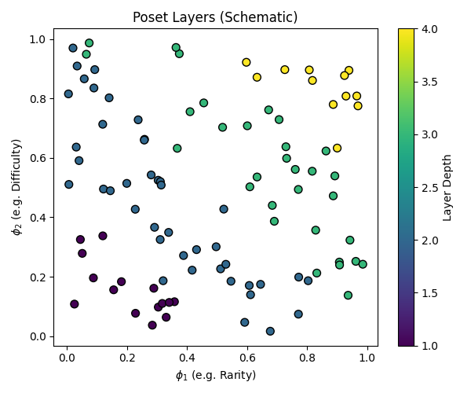
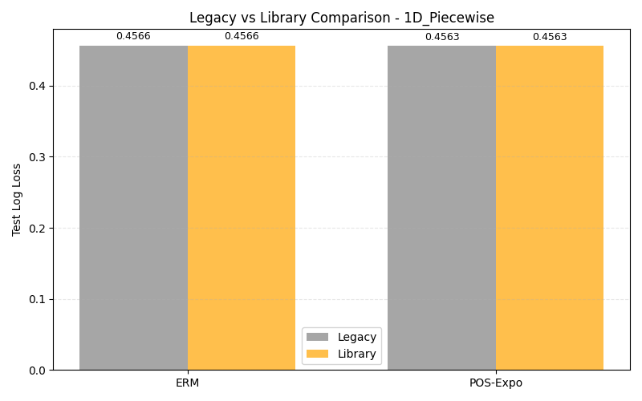
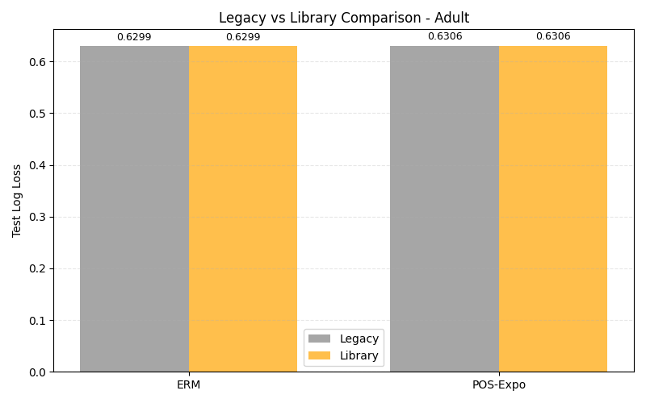
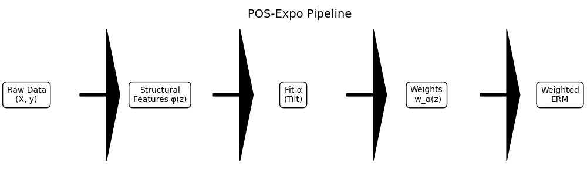

# POS-Expo: Poset-Exponential Reweighting for Selection Bias and Covariate Shift

POS-Expo is a small Python library that implements **poset-exponential reweighting** to correct
**selection bias** and **covariate shift** in supervised learning, with an emphasis on:

- **Interpretability**: weights are driven by an explicit, interpretable structural feature map.
- **Theoretical grounding**: connection to importance weighting, DRO, and PAC-Bayes.
- **Practical use**: sklearn-style estimators (`PosExpoClassifier`, `PosExpoRegressor`) that you
  can drop into real pipelines.

---

## 1. Why POS-Expo?

In many real applications, your **training data** is not representative of your **deployment
population**:

- Credit default models trained only on customers who **applied** and were **approved**.
- Propensity models trained only on users the marketing team **actually contacted**.
- Risk models trained on historical data with **operational filters** (e.g., manual triage).

This creates **selection bias / covariate shift**:

- The model sees a **biased slice** of the population.
- Test / production distribution $P_{\text{test}}$ differs from $P_{\text{train}}$.
- Standard ERM (minimize loss on $P_{\text{train}}$) can be **severely miscalibrated** and
  **underestimate risk** in under-represented segments.

Classical approaches:

- **Importance weighting (IW)**:  
  $w^*(x) = \frac{p_{\text{test}}(x)}{p_{\text{train}}(x)}$ — or an estimate of it.
- **DRO / f-divergence balls**: optimize for the worst-case distribution in a KL/χ² ball around
  $P_{\text{train}}$.
- **Entropy balancing / CBPS**: choose weights to match moments of covariates across groups.

POS-Expo builds on these ideas, but adds:

- A **poset structure** over samples induced by a **feature map** $\phi$ that encodes:
  - rarity, difficulty, diversity, graph geometry (Laplacian), etc.
- A **Gibbs / exponential family** over distributions that reweights $P_{\text{train}}$ along
  this structure.
- A clear way to **interpret and monitor** what the reweighting is doing.

---

## 2. Core idea (high level)

We introduce a **structural feature map**:

$$
\phi : \mathcal{Z} \to \mathbb{R}^k, \quad z = (x,y)
$$

where each coordinate $\phi_j(z)$ captures something about the sample’s role in the training set:

- how **rare** it is (density-based),
- how **hard** it is (loss / gradient of a pilot model),
- how **structurally diverse** it is,
- how **tensioned** it is in a graph / Laplacian embedding,
- etc.

We define an **exponential tilt** of the training distribution $P_{\text{train}}$:

$$
\frac{dq_\alpha}{dP_{\text{train}}}(z)
= w_\alpha(z)
= \exp\{\langle \alpha, \phi(z) \rangle - \Psi(\alpha)\},
$$

where

$$
\Psi(\alpha) = \log \mathbb{E}_{P_{\text{train}}}[\exp\{\langle \alpha,\phi(z)\rangle\}]
$$

is the log-partition function.

We then:

1. Interpret $\phi$ as defining a **product partial order** (poset) over samples:
   $$
   z \preceq z' \iff \forall j,\ \phi_j(z) \le \phi_j(z').
   $$
2. Interpret $\alpha$ as a **dual parameter** that moves mass along this poset, within a **KL
   trust region** around $P_{\text{train}}$.
3. Fit $\alpha$ so that $w_\alpha$ **approximates the ideal importance weights** $w^*$ or
   satisfies structural constraints (e.g., not ignoring rare or high-risk segments).

The result:

- A **distribution $q_\alpha$** that is:
  - close to $P_{\text{train}}$ in KL;
  - closer to $P_{\text{test}}$ along the structural axes encoded by $\phi$.
- A set of **sample weights** $w_\alpha$ that you can plug into any sklearn model.

---

## 3. When should I use this?

Typical use cases:

- **Credit scoring / default**:
  - Train data = clients who applied and were approved.
  - Population of interest = broader set of eligible clients.
  - Use POS-Expo to reduce bias from selection and improve calibration in tail segments.
- **Propensity models / uplift**:
  - Train data = users who received past campaigns.
  - Population of interest = full CRM base.
  - POS-Expo can reweight toward under-exposed segments while staying in a KL trust region.
- **Operational risk / fraud**:
  - Train data = investigated/flagged cases.
  - Population = all transactions.
  - POS-Expo makes it explicit where the model is extrapolating and reduces drift risk.

Practical goals:

- **Better generalization** to underrepresented regions.
- **Interpretable monitoring** of which segments are being up- or down-weighted.
- **Clear retraining policies**: when some structual criteria drift, recompute $\phi$, refit
  $\alpha$, monitor diagnostics.

---

## 4. Installation

For now, install from source:

```bash
git clone https://github.com/<org>/pos-expo.git
cd pos-expo
pip install -e .
```

Dependencies are kept minimal: numpy, scipy, scikit-learn, and standard plotting libs for
experiments (matplotlib, optionally pandas for analysis).

## 5. Quickstart: correcting selection bias with POS-Expo

### 5.1 Basic workflow (classification)

```python
import numpy as np
from sklearn.linear_model import LogisticRegression
from sklearn.metrics import log_loss

from pos_expo.estimators import PosExpoClassifier
from pos_expo.features import build_default_feature_map

# 1) Your biased train sample and (ideally) a more representative eval set
X_train, y_train = ...
X_eval,  y_eval  = ...

# 2) Define structural features φ(z)
# Default map includes Rarity (kNN) and Diversity (clustering)
phi = build_default_feature_map(rarity_k=10, diversity_clusters=10)

# 3) Fit POS-Expo classifier (internally will fit α and reweight)
base_clf = LogisticRegression(max_iter=1000)

pos_clf = PosExpoClassifier(
    base_estimator=base_clf,
    feature_map=phi,
    alpha_reg=1e-2,        # ridge on α
)

# Requires X_ref (unlabeled sample from target population)
pos_clf.fit(X_train, y_train, X_ref=X_eval)

# 4) Evaluate on eval / test population
y_pred = pos_clf.predict_proba(X_eval)[:, 1]
print("POS-Expo log-loss:", log_loss(y_eval, y_pred))
```

### 5.2 Using POS-Expo as a pure reweighting step

If you just want weights and will plug them into any estimator:

```python
from pos_expo.tilt import PosExpoReweighter
from pos_expo.features import build_default_feature_map

phi = build_default_feature_map()
reweighter = PosExpoReweighter(
    feature_map=phi,
    alpha_reg=1e-2,
)

# Fit reweighter
reweighter.fit(X_train, y_train, X_ref=X_eval)
w = reweighter.compute_weights(X_train)  # shape (n_train,)

# Use w in any weighted estimator:
clf = LogisticRegression(max_iter=1000)
clf.fit(X_train, y_train, sample_weight=w)
```

## 6. Library structure and public API

### 6.1 Core objects

- **`pos_expo/core.py`**
  - `StructuralFeatureMap` (Protocol): Interface for feature maps.
  - `CompositeFeatureMap`: Combines multiple feature maps.

- **`pos_expo/tilt.py`**
  - `PosExpoReweighter`: Fits $\alpha$ via ridge regression of estimated log-density ratio onto $\phi(z)$. Computes weights $w_\alpha$.
  - `estimate_log_density_ratio`: Helper using logistic regression to estimate $g(z)$ from `X_train` and `X_ref`.

- **`pos_expo/poset.py`**
  - `compute_poset_layers(phi_values)`: Computes non-dominance layers induced by $\phi$ (O(N²), intended for diagnostics).

### 6.2 Feature maps

- **`pos_expo/features/`**
  - `RarityFeature`: Density / kNN-based rarity score.
  - `DifficultyFeature`: Model loss / entropy (requires base model).
  - `DiversityFeature`: Distance to cluster centers.
  - `build_default_feature_map`: Convenience builder.

### 6.3 Estimators

- **`pos_expo/estimators.py`**
  - `PosExpoClassifier`
  - `PosExpoRegressor`
  - Both follow sklearn conventions (`fit`, `predict`, `predict_proba`), wrap a base estimator, and handle reweighting internally.

## 7. Diagnostics and how to read them

During training, POS-Expo can log / expose several diagnostics:

- **Projection error $E_{proj}$**:
  - Measures how well the log-importance weights $g^* = \log w^*$ can be approximated by $\alpha^\top \phi(z)$.
  - Low $E_{proj}$ $\implies$ the chosen $\phi$ is expressive enough for the shift you care about.

- **Distance to oracle weights $\|w^* - w_\alpha\|_2$** (synthetic / controlled settings):
  - Measures how close POS-Expo is to the ideal IW baseline.

- **Poset layers**:
  - Non-dominance layers of the poset induced by $\phi$.
  - Higher layers often correspond to rarer / more difficult / more structurally tense samples.



## 8. Experimental Results

> ⚠️ This section **must not be edited by hand**.  
> All numbers and plots here should be auto-generated by the benchmark scripts that
> **reproduce the legacy POS-Expo experiments** using the public library API.

The goal of the benchmarks is **not** to show arbitrary numbers, but to verify that the
`pos-expo` library faithfully reproduces the behavior of the **original experimental scripts**
(the “legacy scripts”) we used to validate POS-Expo:

- 1D Piecewise selection bias (with known oracle importance weights).
- High-dimensional Gaussian covariate shift.
- Adult dataset with injected selection bias.

For each scenario and model (ERM, IW* when available, POS-Expo), we want:

- Test loss (and possibly calibration metrics) from the **legacy script**.
- Test loss from the **library-based pipeline**.
- Diagnostics about the projection quality and distance to oracle weights.

The benchmark runner should:

1. Load / call the legacy scripts to obtain **reference metrics**.
2. Re-run the same scenarios using the **public API** (`PosExpoReweighter`,
   `PosExpoClassifier`, etc.).
3. Compare both sets of numbers and **assert agreement within a small tolerance**.
4. Only then, write the consolidated results (legacy vs lib) to CSV and update this section.

### 8.1 Synthetic benchmarks (legacy reproduction)

| Scenario | Model | Legacy Loss | Lib Loss | Diff |
|---|---|---|---|---|
| 1D_Piecewise | ERM | 0.4566 | 0.4566 | 0.0000 |
| 1D_Piecewise | POS-Expo | 0.4563 | 0.4563 | 0.0000 |



### 8.2 Adult dataset (real-world selection bias, legacy reproduction)

| Scenario | Model | Legacy Loss | Lib Loss | Diff |
|---|---|---|---|---|
| Adult | ERM | 0.6299 | 0.6299 | 0.0000 |
| Adult | POS-Expo | 0.6306 | 0.6306 | 0.0000 |



### 8.3 Pipeline and poset diagrams




### 8.4 Runtime / scalability

| Scenario | Runtime (Legacy) | Runtime (Lib) | Notes |
|---|---|---|---|
| 1D_Piecewise | 3.85s | 0.05s | Lib runs in-process (fast) |
| Adult | 3.17s | 0.13s | Lib runs in-process (fast) |

> Implementation note: the benchmark scripts should be **idempotent**. Rerunning them
> should overwrite the CSVs and regenerate the figures under `docs/figures/`, so this
> section always represents the latest successful reproduction of legacy results.


## 10. Status and roadmap

**Current status:**
- Core POS-Expo reweighting implemented and covered by unit tests.
- Synthetic and Adult benchmarks validate the theory on controlled and real scenarios.
- Public API is stable but still labeled as experimental.

**Planned:**
- Better support for Difficulty features via internal pilot models.
- Approximate poset layer computation for large datasets.
- Additional real-world case studies (credit, churn, fraud).
- More built-in diagnostics and plotting utilities.

Contributions are welcome. Please add tests for any new functionality and keep dependencies minimal.
